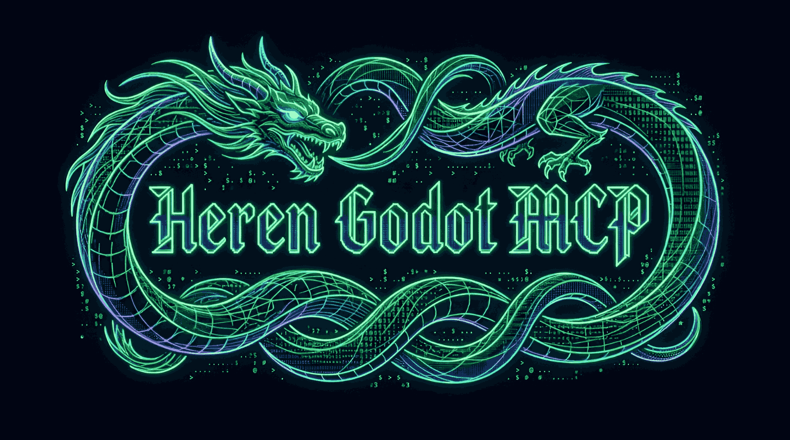

<div align="center">



<p>
  <a href="README.md">🇪🇸 Español</a> •
  <a href="README.en.md">🇬🇧 English</a>
</p>

</div>

---

> *"Technique is a compositional or destructive activity, violent, and this is what Aristotle called poiesis, poetry, precisely."* — **Gustavo Bueno**

---

# ⚔️ Heren Godot MCP

🏰 **Heren Godot MCP** — *Plus Ultra*: go beyond. 🐉

High-performance MCP server for **Godot Engine 4.x** that enables AI agents and assistants to control projects directly: create scenes, manipulate nodes, manage resources, connect signals and validate code, **all through a persistent daemon that operates in milliseconds**.

---

## ⚔️ Features

| Feature | Description |
|---|---|
| 🔌 **Persistent WebSocket Daemon** | Godot headless keeps connection alive via WebSocket — operations in ~20ms |
| 🛠️ **15 Centralized Tools** | Scenes, nodes, resources, scripts, signals, animations, shaders, validation and debug |
| ⚡ **Batch Operations** | Execute multiple operations in a single WebSocket call |
| 🔄 **Automatic Fallback** | If daemon is unavailable, uses temporary scripts (Godot CLI) |
| 🛡️ **Integrated Validation** | Validates scenes, scripts, nodes and resources before applying changes |
| 🐛 **Full Debug** | Breakpoints, stack traces, watch variables and console capture |
| 📸 **Screenshots** | Capture frames from scenes with GPU rendering |
| 🌍 **Native I18n** | Built-in Spanish/English localization system |

---

## 🛡️ Against Other Godot MCPs

### Speed: Persistence vs. Intermediation

The main difference: other MCPs launch `godot --headless --script` for each operation (~370ms overhead). Heren MCP keeps a persistent Godot daemon via WebSocket — operations in milliseconds.

| Operation | [Coding-Solo](https://github.com/Coding-Solo/godot-mcp) (3.6k⭐) | [GoPeak](https://github.com/HaD0Yun/Gopeak-godot-mcp) (179⭐) | **Heren Godot MCP** |
|---|---|---|---|
| Read scene | ~367ms (Godot headless) | ~80ms* (WebSocket) | **~20ms** (persistent daemon) |
| Add node | ~367ms | ~60ms* | **~20ms** |
| Batch 10 ops | ~3.7s | ~600ms* | **~200ms** |

*Estimated with plugin already installed and running

### Full Comparison

| Dimension | [Coding-Solo](https://github.com/Coding-Solo/godot-mcp) | [GoPeak](https://github.com/HaD0Yun/Gopeak-godot-mcp) | [tugcantopaloglu](https://github.com/tugcantopaloglu/godot-mcp) | **Heren Godot MCP** |
|---|---|---|---|---|
| **Tools** | ~15 | 95+ | 149 | **15** |
| **Persistence** | ❌ (launches Godot each time) | ✅ (WebSocket) | ❌ | **✅ (WebSocket daemon)** |
| **Speed** | Slow (~367ms/op) | Medium (~80ms/op) | Slow (~2-5s/op) | **⚡ Fast (~20ms/op)** |
| **No Godot Plugin** | ✅ | ❌ (requires addon) | ❌ | **✅** |
| **No Node.js** | ❌ (requires npm) | ❌ (requires npm) | ❌ | **✅ (Python only)** |
| **Batch operations** | ❌ | ✅ | ❌ | **✅** |
| **Automatic Fallback** | ❌ | ❌ | ❌ | **✅** |
| **Debug (breakpoints)** | ❌ | ✅ (DAP) | ❌ | **✅** |
| **Screenshots** | ❌ | ✅ | ❌ | **✅** |
| **Validation** | ❌ | ❌ | ❌ | **✅** |
| **I18n** | ❌ | ❌ | ❌ | **✅** |
| **Setup time** | npm install | 60s+ plugin | npm install | **🚀 0s** |
| **Persistent Memory** | 0MB | ~450MB | 0MB | **💾 ~75MB** |

### Feature Comparison

| Feature | Coding-Solo | GoPeak | tugcantopaloglu | **Heren** |
|---|---|---|---|---|
| **Persistent Daemon** | ❌ | ✅ | ❌ | **✅** |
| **No Plugin Required** | ✅ | ❌ | ❌ | **✅** |
| **Batch Operations** | ❌ | ✅ | ❌ | **✅** |
| **Signal Connection** | ❌ | ✅ | ✅ | **✅** |
| **Autoload Management** | ❌ | ✅ | ✅ | **✅** |
| **Debug Breakpoints** | ❌ | ✅ | ❌ | **✅** |
| **GPU Screenshots** | ❌ | ✅ | ❌ | **✅** |
| **Scene Validation** | ❌ | ❌ | ❌ | **✅** |
| **Shaders & Materials** | ❌ | ✅ | ✅ | **✅** |
| **TileMap/Terrain** | ❌ | ✅ | ✅ | **✅** |
| **Skeleton/Rigging** | ❌ | ❌ | ❌ | **✅** |
| **LSP (autocomplete)** | ❌ | ✅ | ❌ | ❌ |
| **DAP (advanced debugger)** | ❌ | ✅ | ❌ | ❌ |
| **Runtime Inspection** | ❌ | ✅ | ❌ | ❌ |
| **Input Injection** | ❌ | ✅ | ❌ | ❌ |
| **Asset Library** | ❌ | ✅ | ❌ | ❌ |
| **Spanish Docs** | ❌ | ❌ | ❌ | **✅** |
| **Installation** | `npx` (npm) | `npx` (npm) | npm | **`pip` (Python)** |

**What we have and they don't:** Persistent daemon with 0s setup, batch operations, automatic fallback, integrated validation, debug breakpoints, GPU screenshots, Spanish docs, no plugin or Node.js required.

**What they have and we don't:** LSP (GDScript autocomplete), DAP (advanced debugger with breakpoints), runtime inspection, input injection, asset library.

---

## 🌍 Made for the Spanish and Portuguese-speaking Community

The Godot community in Spanish and Portuguese is huge, but AI tools for game development are designed exclusively in English. Heren Godot MCP is born from that reality:

- 🇪🇸 **Spain**
- 🇲🇽 **Mexico**
- 🇦🇷 **Argentina**
- 🇨🇴 **Colombia**
- 🇧🇷 **Brazil**
- 🇵🇹 **Portugal**
- And all of **Ibero-America**

> **No language barrier**: because making games shouldn't require speaking English.

Documentation is in **Spanish** and **English**. Function and variable names maintain consistency with Godot (English), but all documentation, guides and communication are in our languages.

---

## 📦 Installation

### From Source

```bash
git clone https://github.com/your-username/heren-mcp.git
cd heren-mcp
pip install -e .
```

### Automatic Installer

```bash
python install.py
```

### Requirements

- 🐍 **Python** >= 3.10
- 🎮 **Godot** >= 4.2 (recommended 4.6+)
- 💻 **OS**: Windows, Linux, macOS

---

## ⚙️ MCP Configuration

Add this to your MCP configuration (Cursor, Claude Desktop, OpenCode, etc.):

```json
{
  "mcpServers": {
    "heren": {
      "command": "python",
      "args": ["-m", "heren.server"],
      "env": {
        "GODOT_EXE": "D:/Games/Godot/Godot_v4.6.1-stable_win64.exe"
      }
    }
  }
}
```

### Environment Variables

| Variable | Description | Example |
|----------|-------------|---------|
| `GODOT_EXE` | Path to Godot executable | `D:/Godot/Godot_v4.6.1.exe` |
| `HEREN_PORT` | WebSocket daemon port | `4567` |
| `HEREN_LOG_LEVEL` | Logging level | `INFO`, `DEBUG` |

---

## 🚀 Quick Start

```python
# Start session
session_tool(action="open", project_path="D:/MyGame")
# → {"success": true, "session_id": "abc123", "daemon_active": true}

# Create scene
scene_tool(action="create", session_id="abc123", scene_path="res://Player.tscn")

# Add node
node_tool(
    action="add",
    session_id="abc123",
    scene_path="res://Player.tscn",
    parent_path=".",
    node_type="CharacterBody2D",
    node_name="Player"
)

# Save scene
scene_tool(action="save", session_id="abc123", scene_path="res://Player.tscn")
```

### 🔄 Batch Operations

```python
# Multiple operations in a single call
batch_tool(session_id="abc123", operations=[
    {"action": "add", "params": {
        "scene_path": "res://Player.tscn",
        "parent_path": ".",
        "node_type": "Sprite2D",
        "node_name": "Body"
    }},
    {"action": "add", "params": {
        "scene_path": "res://Player.tscn",
        "parent_path": "Body",
        "node_type": "CollisionShape2D",
        "node_name": "Hitbox"
    }},
    {"action": "save", "params": {
        "scene_path": "res://Player.tscn"
    }}
])
```

---

## 🗡️ Available Tools

| Tool | Actions | Description |
|------|---------|-------------|
| 🎮 **session** | open, close, list, info, health | Session management with Godot |
| 🎬 **scene** | load, save, get_tree, screenshot | Scene operations |
| 🔧 **node** | add, remove, set_prop, get_prop, duplicate, rename, move | Node manipulation |
| ⚡ **signal** | connect, disconnect, list, set_script | Signal connections and scripts |
| 🎭 **animation** | create_player, create, add_track, add_key, state_machine | Animation system |
| 🎨 **shader** | create, edit, validate, material, uniform | Shaders and materials |
| 🦴 **skeleton** | create, add_bone, set_rest, skin, attachment | 2D/3D rigging |
| 🗺️ **tilemap** | inspect_set, inspect_map, set_cell, terrain, pattern | TileMaps and TileSets |
| 📦 **resource** | create, read, update, delete, list | Resource management |
| ⚙️ **project** | setting, autoload, remove_autoload, shader_global | Project configuration |
| 🔄 **batch** | - | High-performance batch operations |
| 🐛 **debug** | breakpoint, stack_trace, watch, console | Debugging tools |
| ✅ **validate** | scene, script, node, resource | File validation |
| 📚 **index** | list, info, example | Tool discovery |

---

## 🏰 Architecture

```
┌─────────────┐      ┌──────────────────┐      ┌─────────────────────┐
│  AI Agent   │──────▶│  Heren MCP Server │─────▶│  Godot Daemon (WS)  │
└─────────────┘      └──────────────────┘      └─────────────────────┘
                              │
                              ▼
                    ┌──────────────────┐
                    │ Session Manager  │
                    │ + Cache (LRU)    │
                    └──────────────────┘
```

### Operation Flow

1. **Agent** sends request to MCP server
2. **Heren MCP** checks for active session
3. If **daemon is active** → WebSocket (~20ms)
4. If no daemon → **Fallback** to scripts (~370ms)
5. **Godot** executes the operation and responds
6. **Cache** stores frequent results

---

## 📚 Documentation

- 📖 [AGENTS.md](AGENTS.md) — Complete guide for AI agents
- 📥 [docs/INSTALL.md](docs/INSTALL.md) — Detailed installation
- 📋 [docs/API.md](docs/API.md) — Complete API reference
- 🏗️ [docs/ARCHITECTURE.md](docs/ARCHITECTURE.md) — Technical architecture
- 🤝 [CONTRIBUTING.md](CONTRIBUTING.md) — How to contribute
- 📝 [CHANGELOG.md](CHANGELOG.md) — Change history

---

## 📊 Benchmarks

See [benchmarks/BENCHMARKS.md](benchmarks/BENCHMARKS.md) for real comparisons with methodology and detailed results.

### Performance Summary

| Operation | With Daemon | Without Daemon |
|-----------|-------------|----------------|
| ⚡ Add node | ~20ms | ~370ms |
| 💾 Save scene | ~15ms | ~340ms |
| 📖 Read tree | ~25ms | ~400ms |
| 📸 Screenshot | ~50ms | ~800ms |

---

## 🤝 Contributing

Contributions are welcome! Read [CONTRIBUTING.md](CONTRIBUTING.md) for:

- 🔄 How to clone and install
- 🧪 How to run tests
- 🐛 How to report bugs
- 🎨 Code style
- 💡 How to propose features

---

## 📜 License

[MIT](LICENSE) © 2026 Heren MCP Contributors

---

<div align="center">

**Made with ❤️ for the Ibero-American Godot community**

⭐ [Star on GitHub](https://github.com/your-username/heren-mcp) · 🐛 [Report bug](https://github.com/your-username/heren-mcp/issues) · 💡 [Propose feature](https://github.com/your-username/heren-mcp/issues)

🏰 **Plus Ultra: go beyond.** 🐉

</div>
